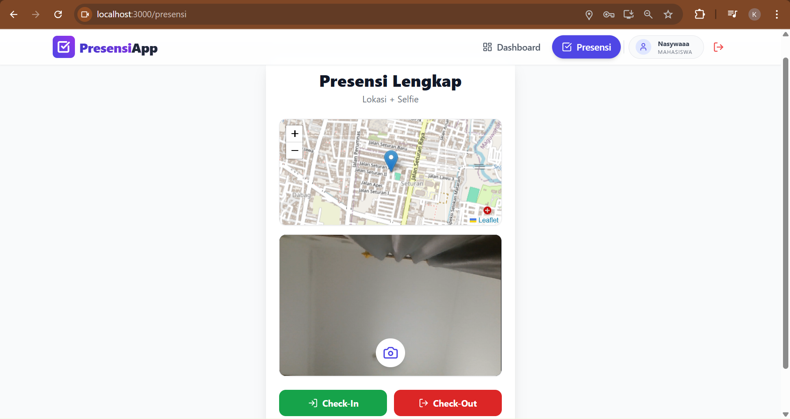
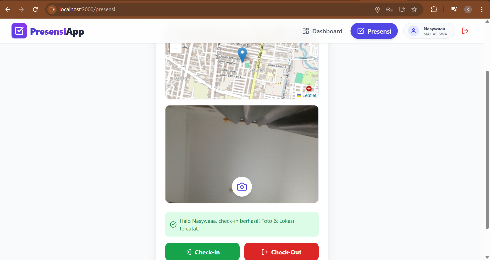
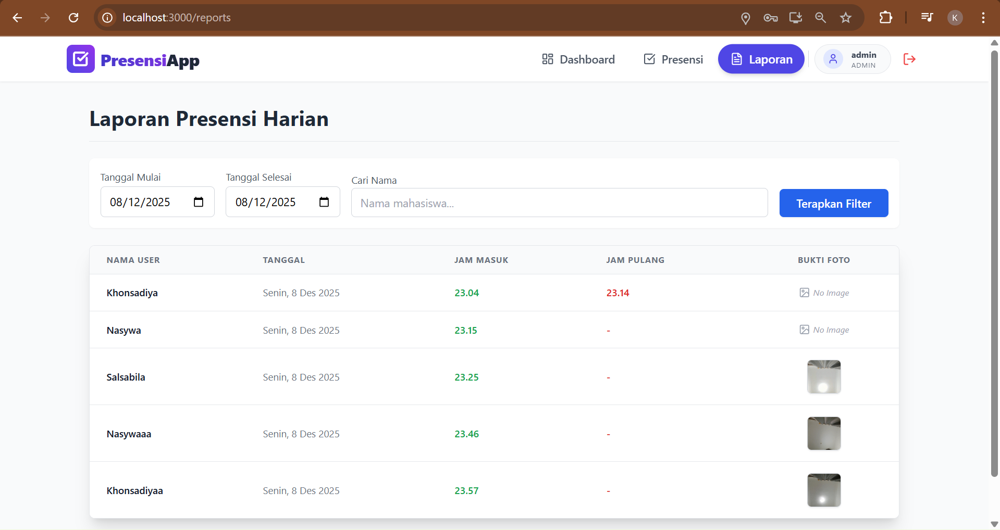
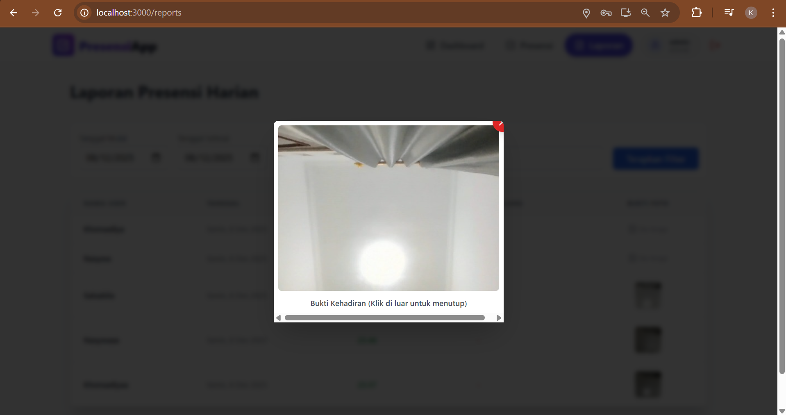
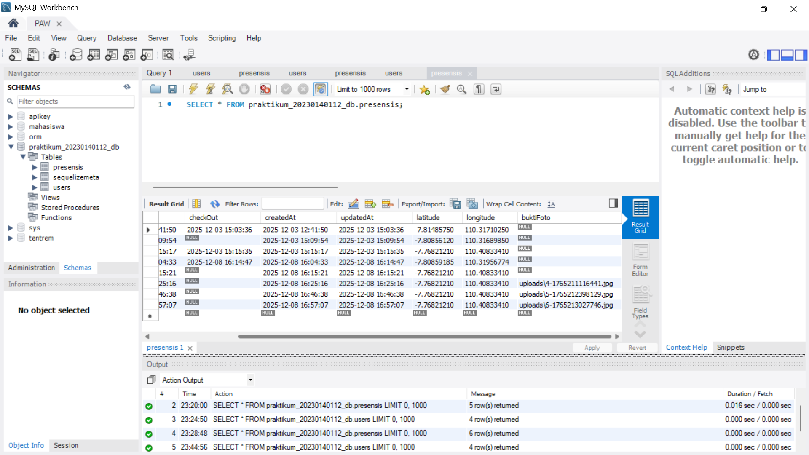

# Tugas 10 - Implementasi Sensor Kamera (Selfie Check-in) & File Handling

**Nama:** Khonsadiya Nasywa Salsabila
**NIM:** 20230140112 
**Kelas:** C 

---

## Screenshots Hasil Praktikum

### 1. PresensiPage yang menampilkan kamera

### 2. Check-In Berhasil dengan Foto

### 3. Bukti Foto di Laporan Admin

### 4. Thumbnail Foto

### 5. Database Presensi 

