# Tugas 2 - Membuat Server HTTP dengan Node.js dan Express.js

**Nama:** Khonsadiya Nasywa Salsabila
**NIM:** 20230140112 
**Kelas:** C 

---

## Screenshots Hasil Praktikum

### 1. GET All Books
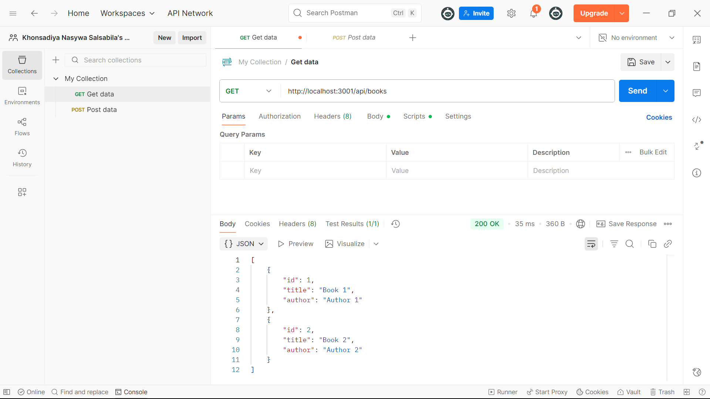

### 2. GET Book by ID
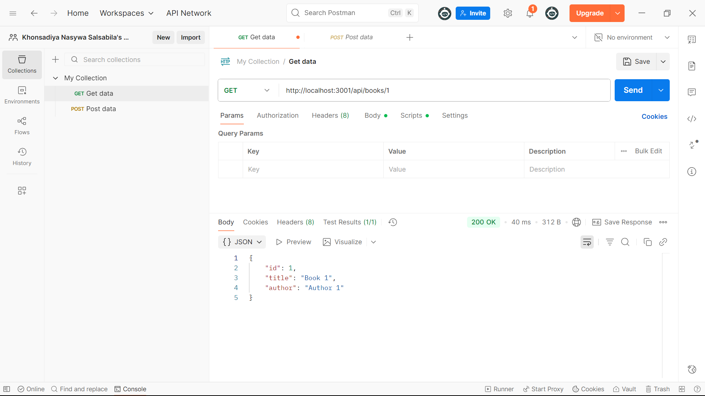

### 3. POST Book
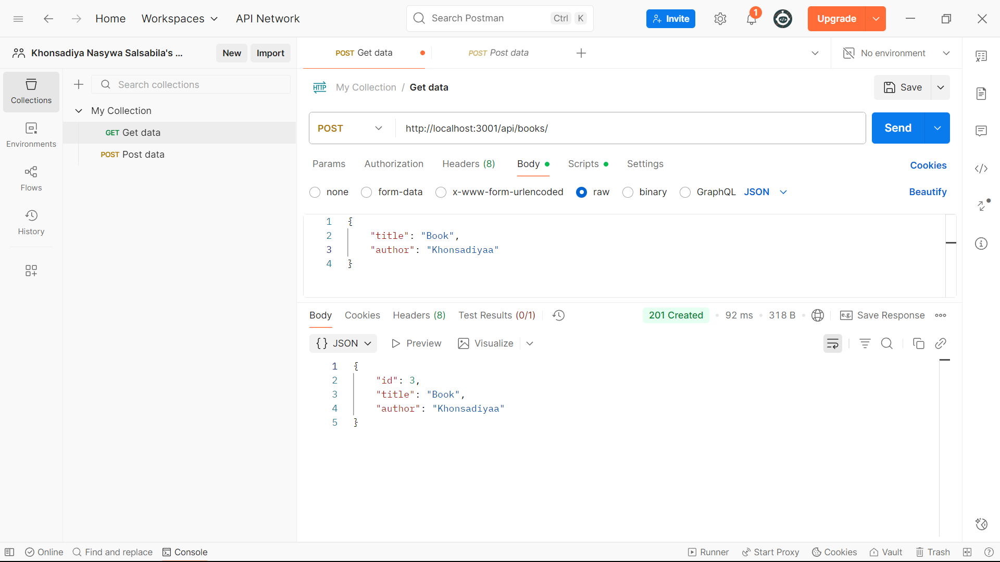
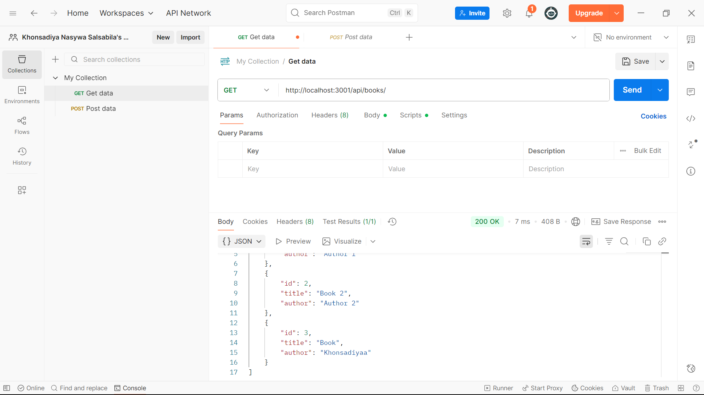

### 4. Validasi Input
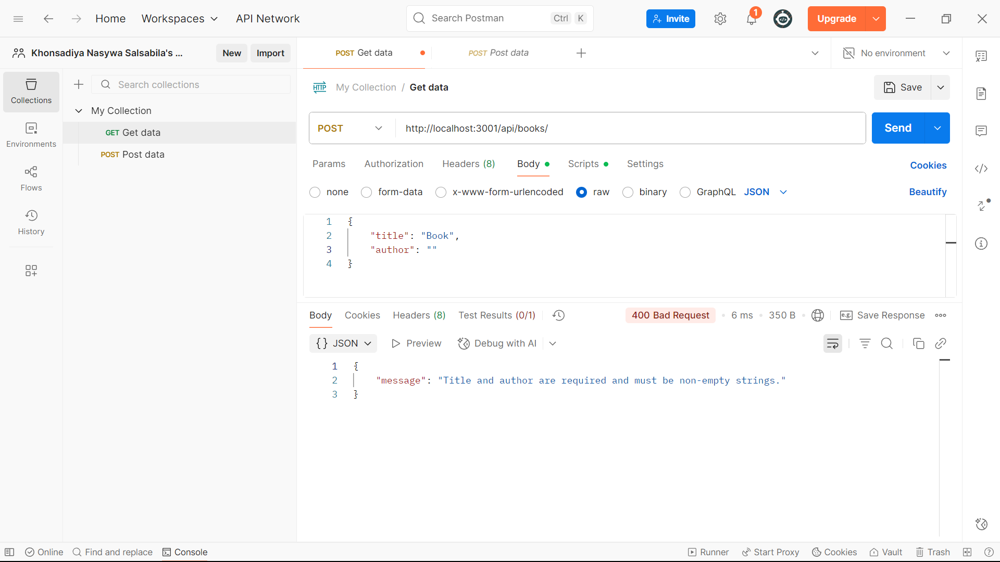

### 5. Validasi Input ID PUT
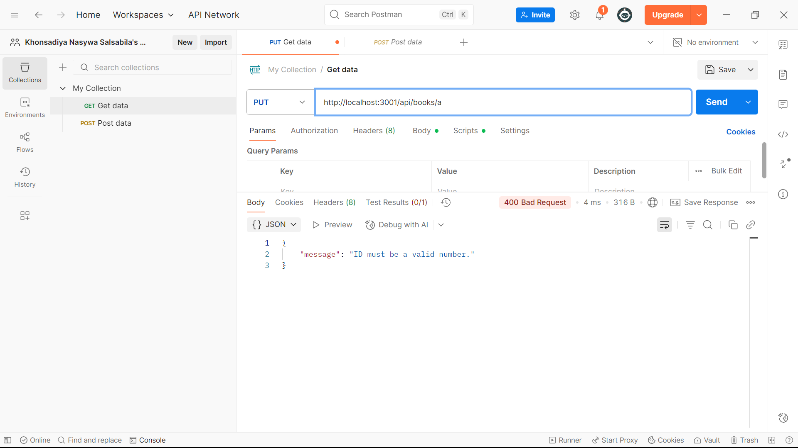
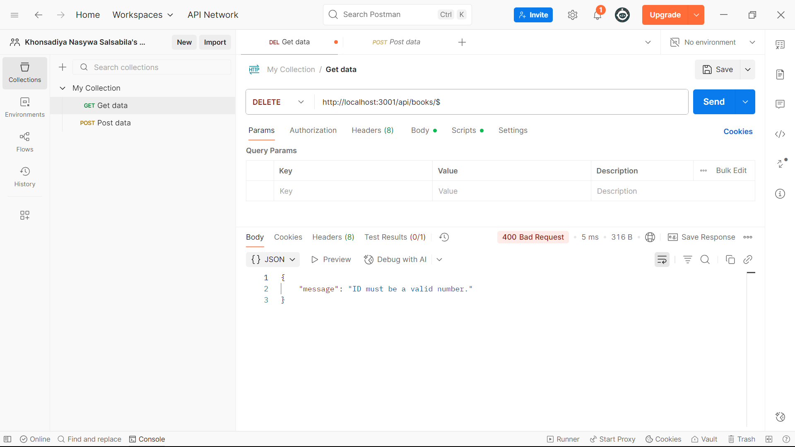

### 6. PUT Book
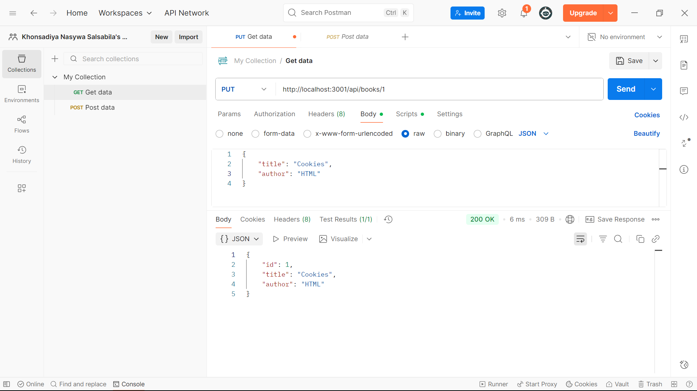
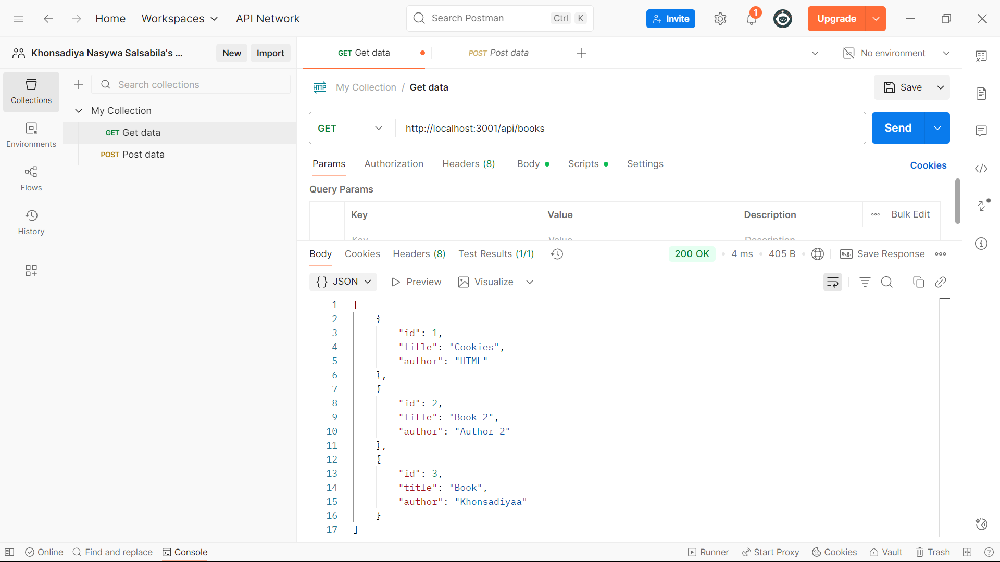

### 7. DELETE Book
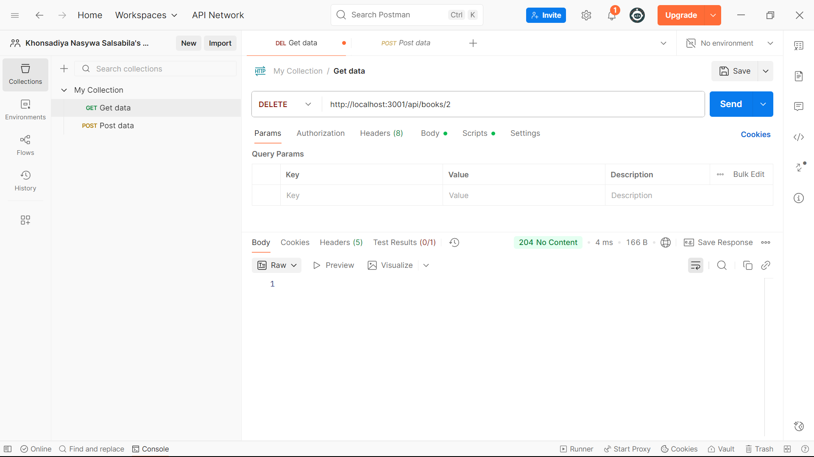
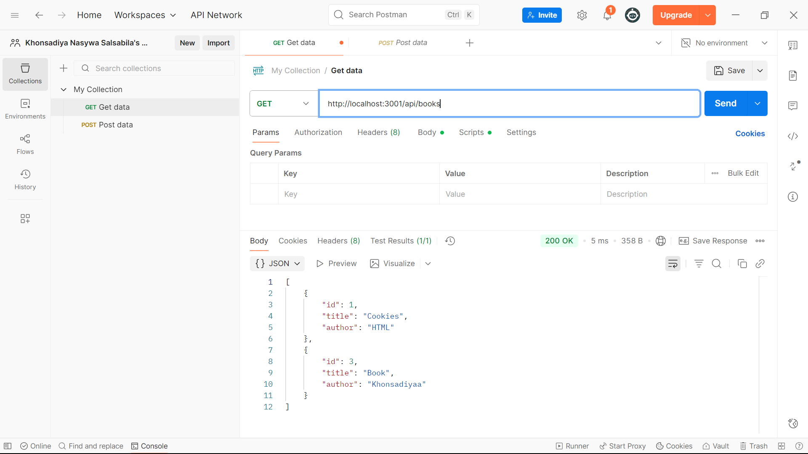

### 8. Middleware Logging
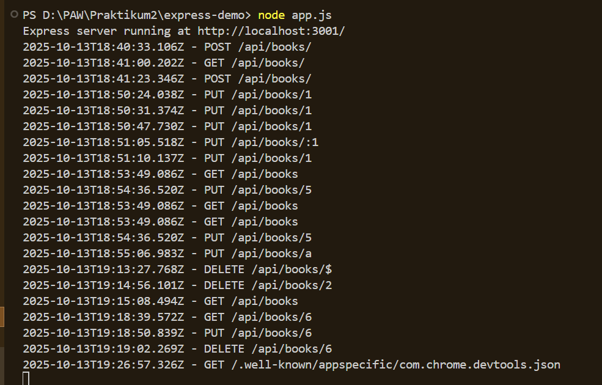

### 9. Error Handling 404
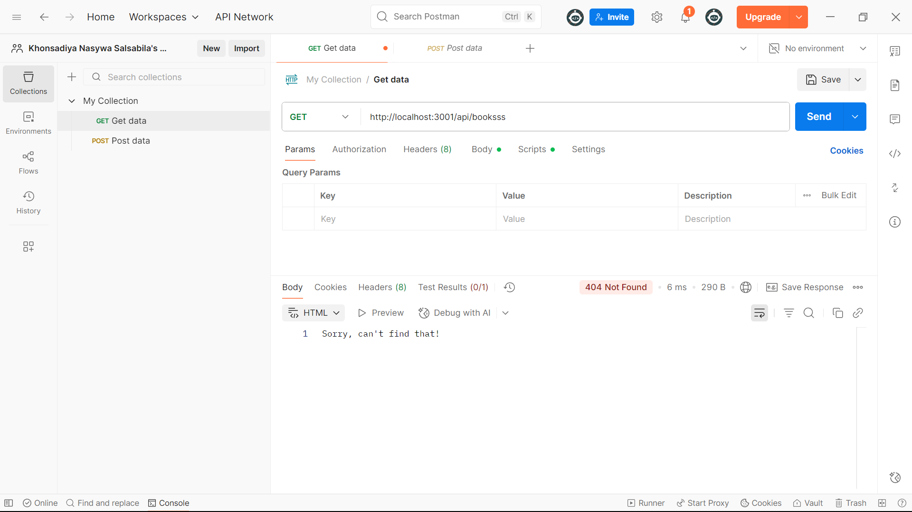

### 10. Global Error Handler
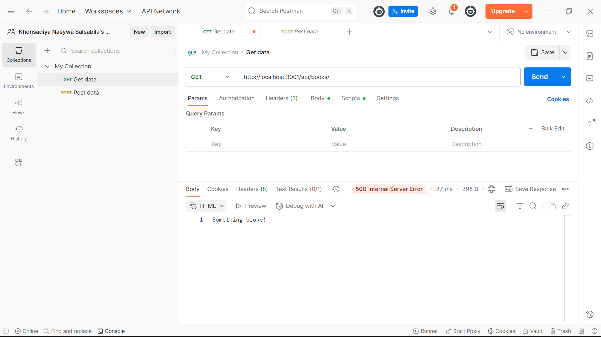