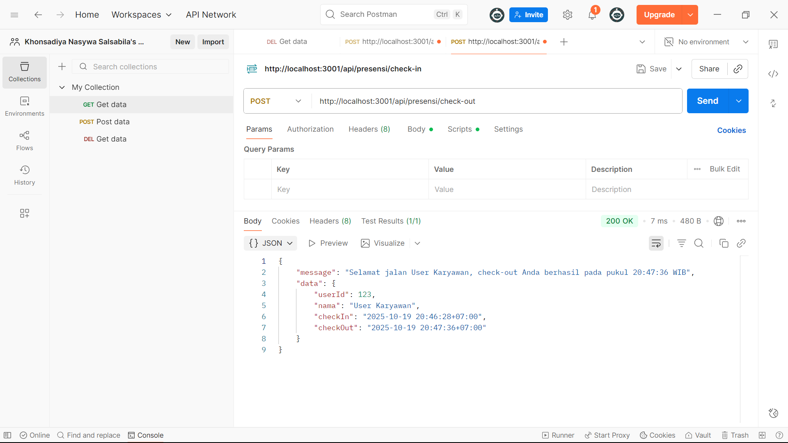
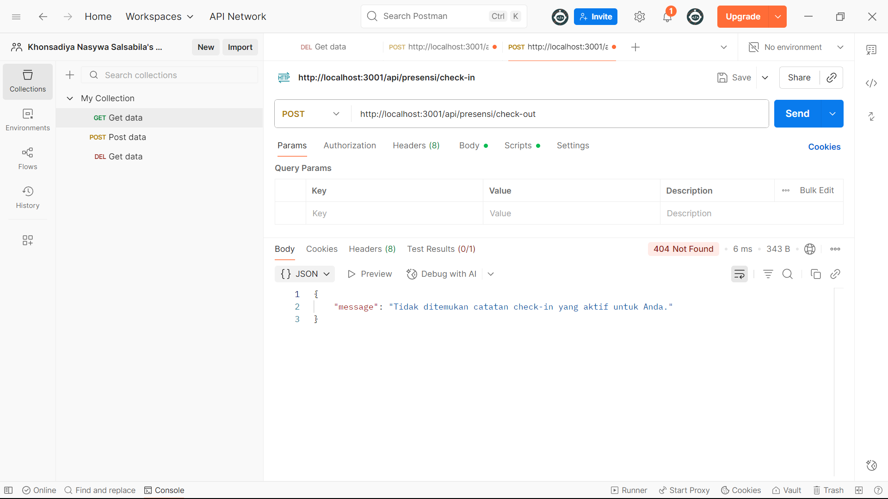
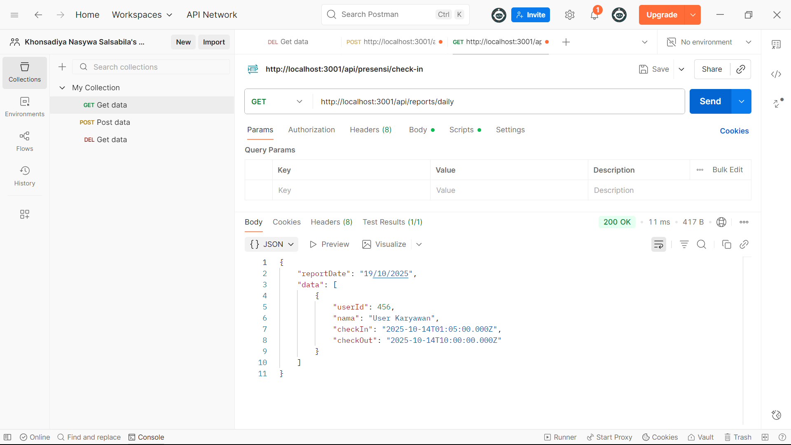
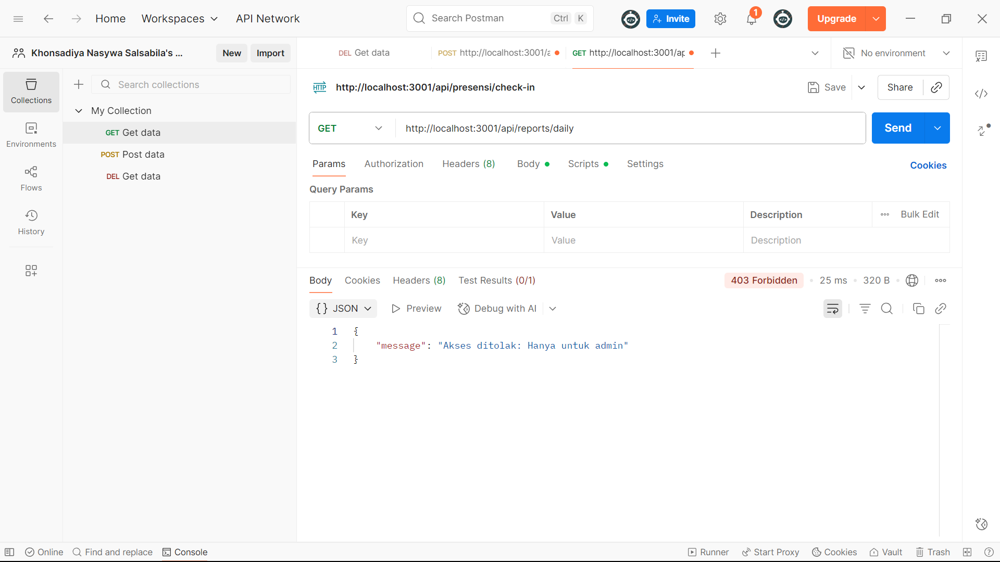

# Tugas 3 - Pengelolaan Routing dan Middleware di Express.js

**Nama:** Khonsadiya Nasywa Salsabila
**NIM:** 20230140112 
**Kelas:** C 

---

## Screenshots Hasil Praktikum

### 1. Check-In pertama kali dalam satu hari

### 2. Check-In ke-2 dalam satu hari

### 3. Check-Out

### 4. Check-Out jika belum check-in

### 5. Melihat report sebagai Admin

### 6. Melihat report sebagai Karyawan

