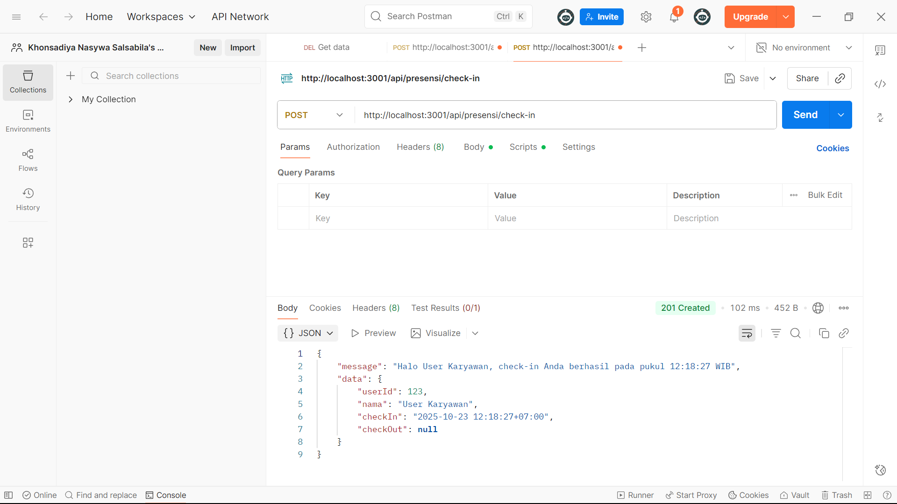
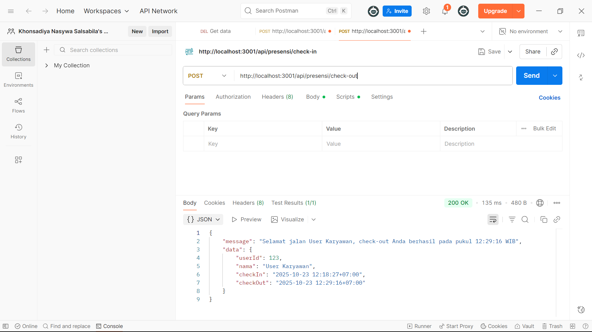

# Tugas 4 - Koneksi Database dan ORM dengan Sequelize

**Nama:** Khonsadiya Nasywa Salsabila
**NIM:** 20230140112 
**Kelas:** C 

---

## Screenshots Hasil Praktikum

### 1. Check-In 

### 2. Database setelah Check-In

### 3. Check-Out 

### 4. Database setelah Check-Out

### 5. Report

