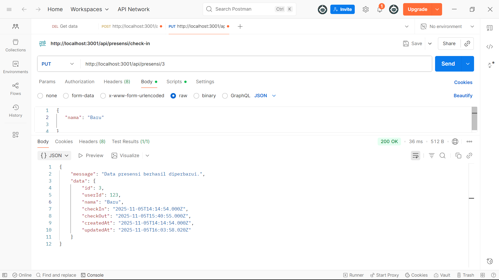
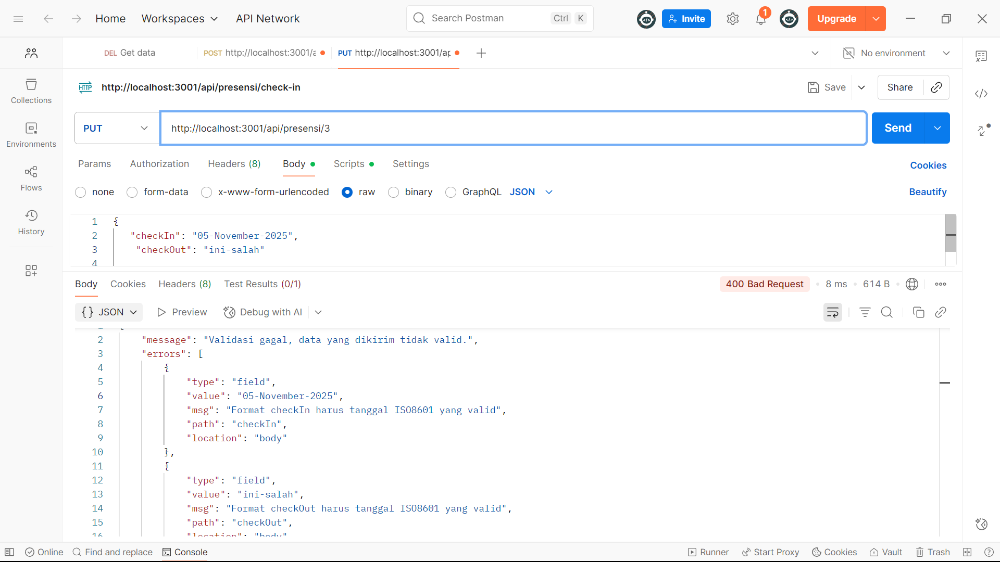
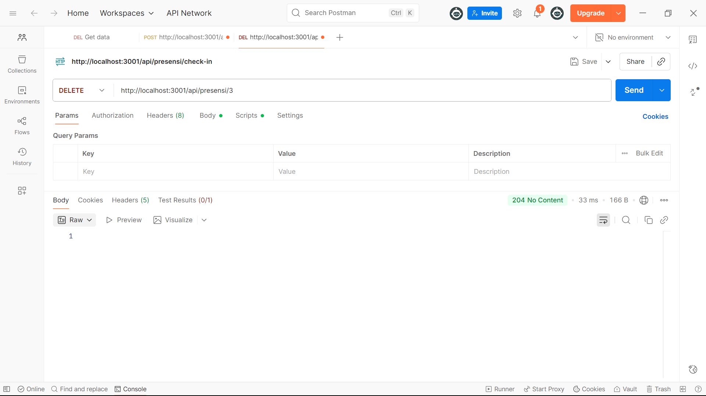
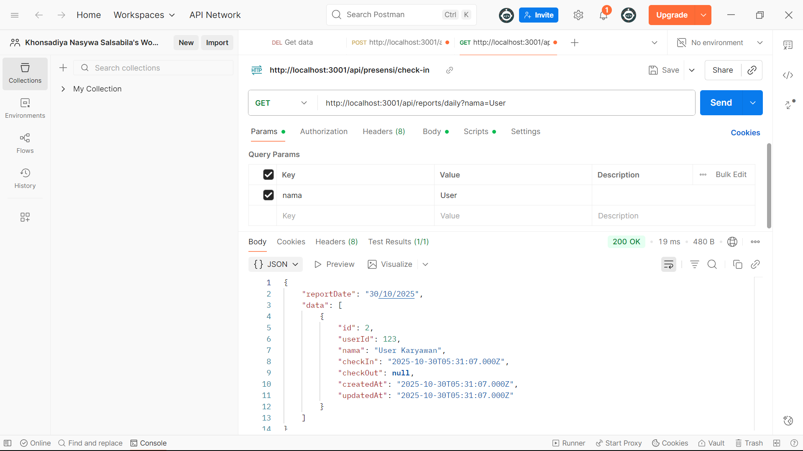
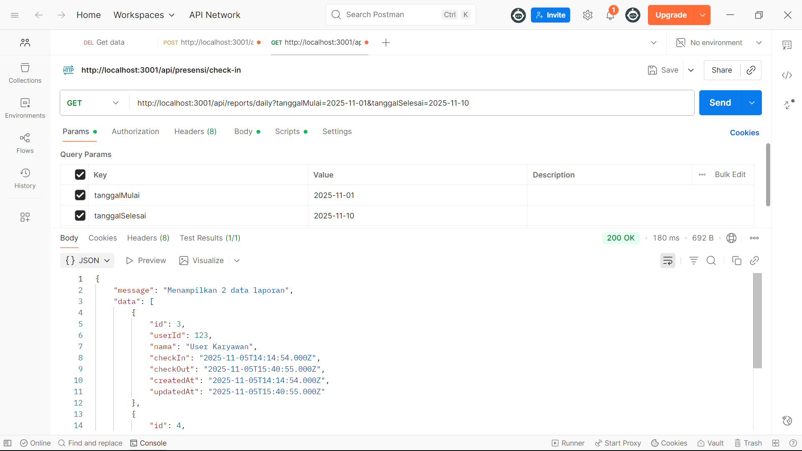

# Tugas 5 - Melengkapi RESTful API (Update, Delete, Search) dengan Sequelize

**Nama:** Khonsadiya Nasywa Salsabila
**NIM:** 20230140112 
**Kelas:** C 

---

## Screenshots Hasil Praktikum

### 1. Update data presensi

### 2. Update jika format tanggal yang diisi tidak valid

### 3. Delete data

### 4. Search berdasarkan nama

### 5. Search berdasarkan tanggal

