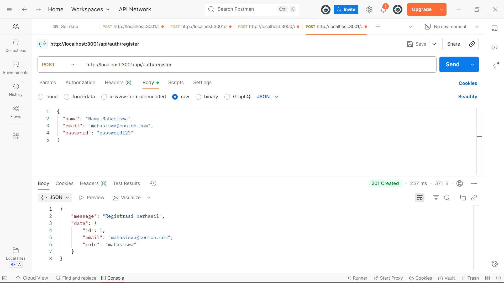
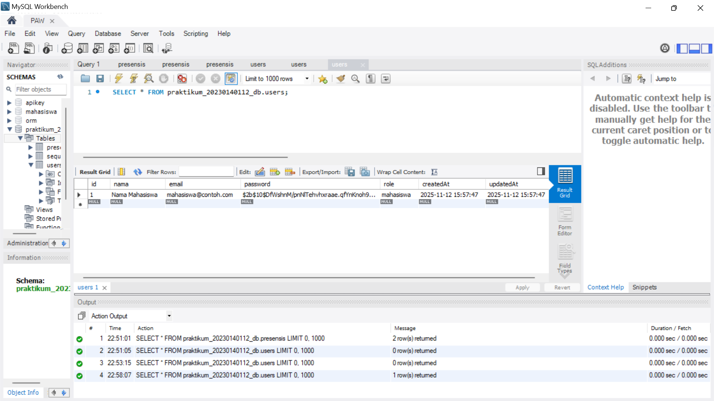
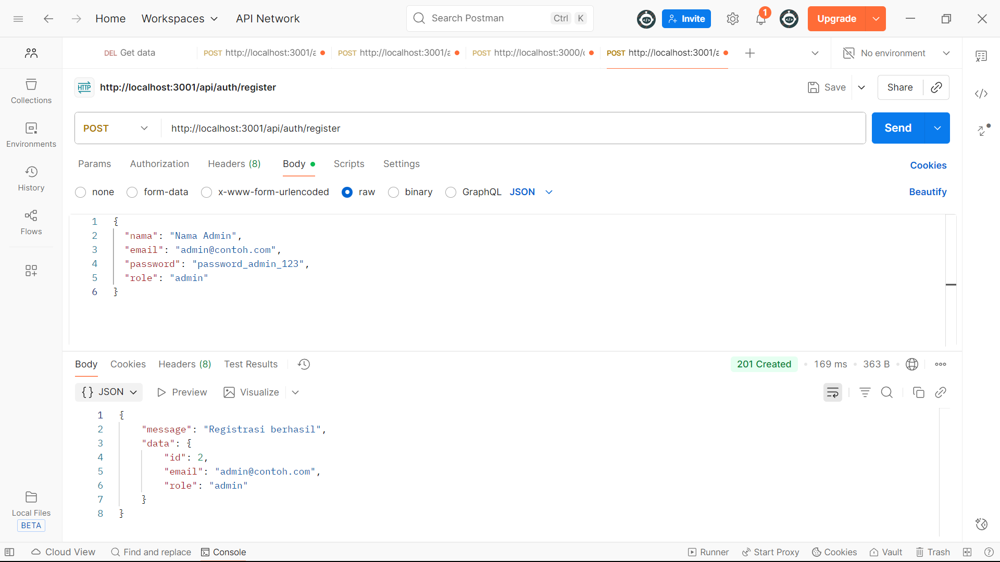
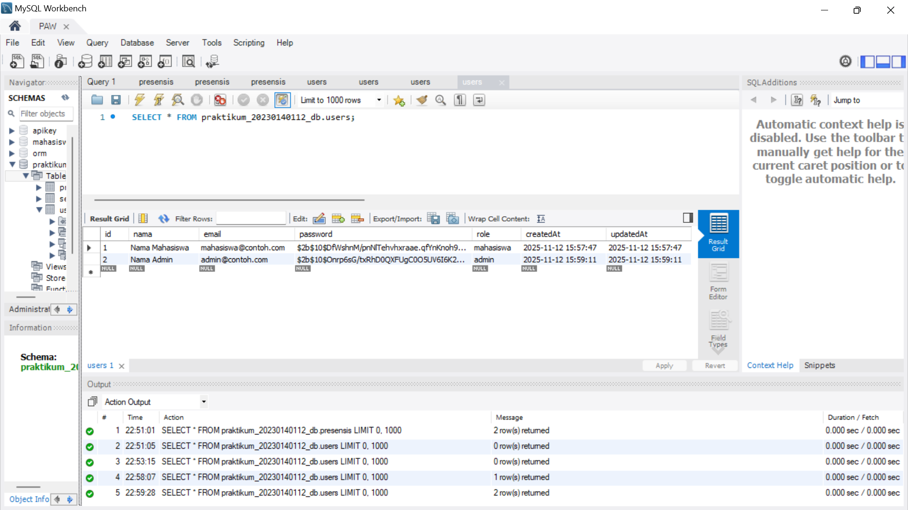

# Tugas 6 - Autentikasi API dengan JWT, Bcrypt, dan Role User

**Nama:** Khonsadiya Nasywa Salsabila
**NIM:** 20230140112 
**Kelas:** C 

---

## Screenshots Hasil Praktikum

### 1. Request POST /register (untuk membuat user "mahasiswa")

### 2. Database setelah user "Mahasiswa" register

### 3. Request POST /register (untuk membuat user "admin")

### 4. Database setelah user "Admin" register

