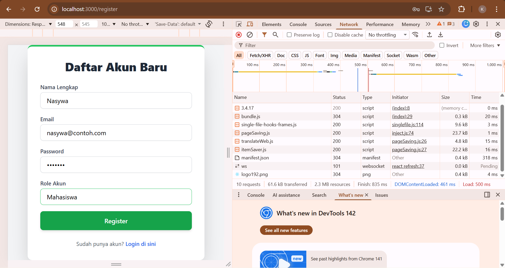
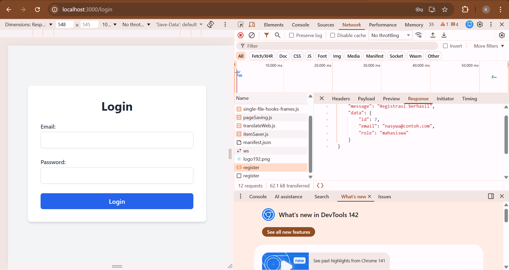
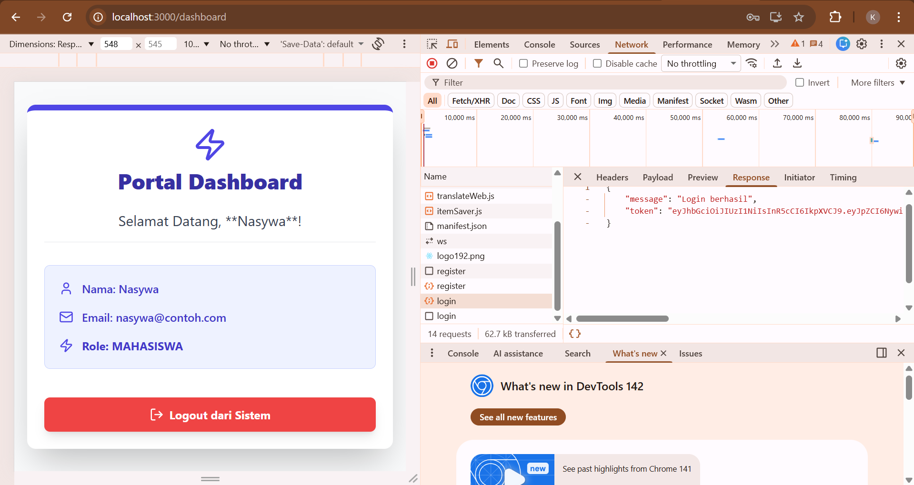
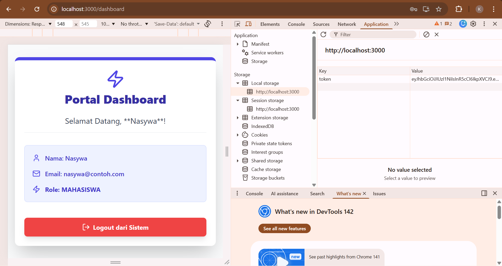
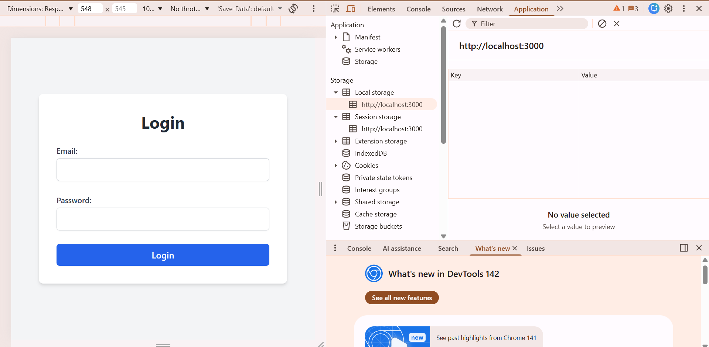

# Tugas 7 - Integrasi Frontend React dengan Backend API (Autentikasi)

**Nama:** Khonsadiya Nasywa Salsabila
**NIM:** 20230140112 
**Kelas:** C 

---

## Screenshots Hasil Praktikum

### 1. Register

### 2. Register mengirim ke endpoint POST

### 3. Dashboard

### 4. Token saat Login

### 4. Token hilang saat LogOut

