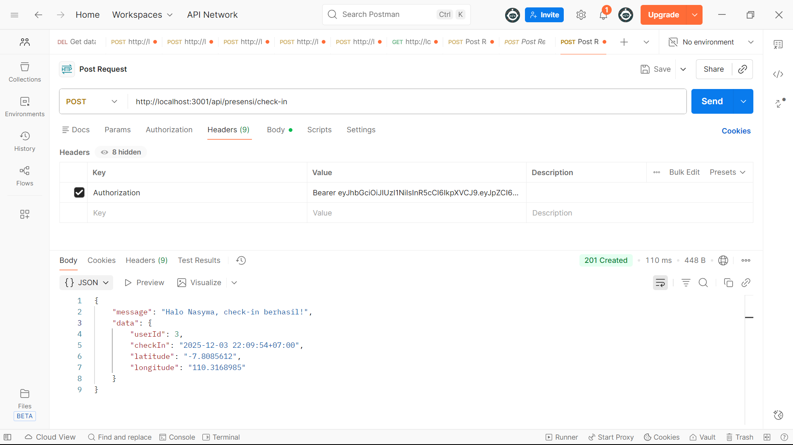
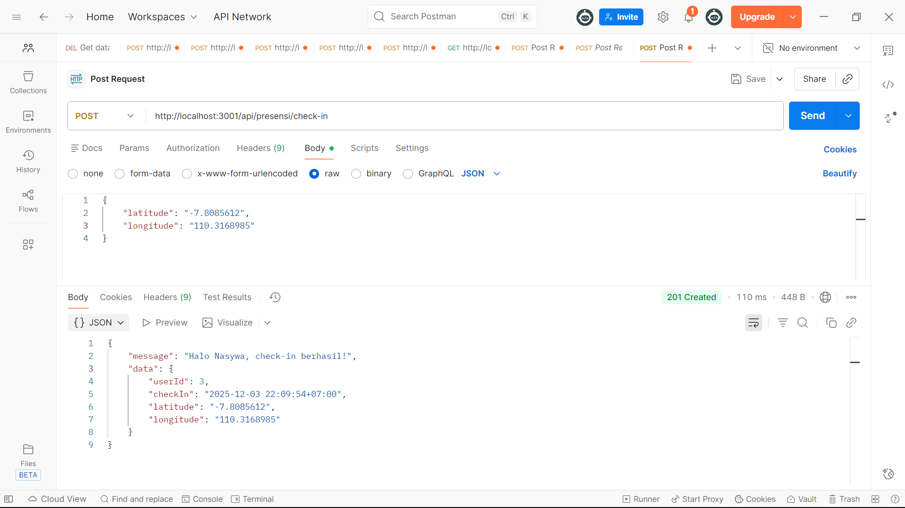
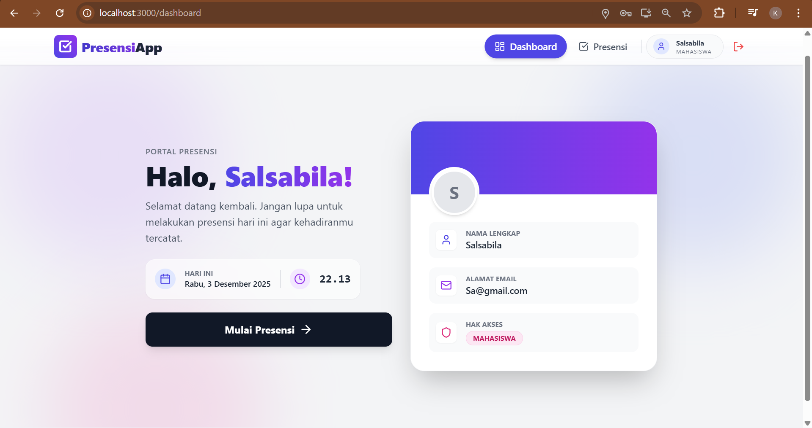
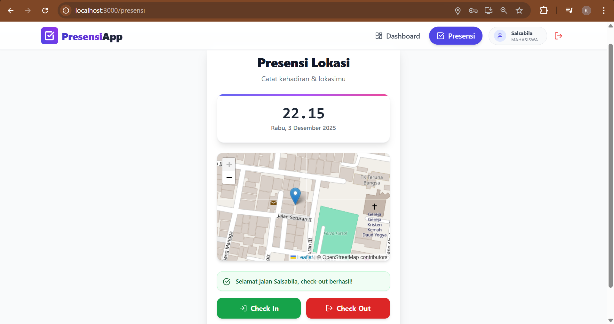
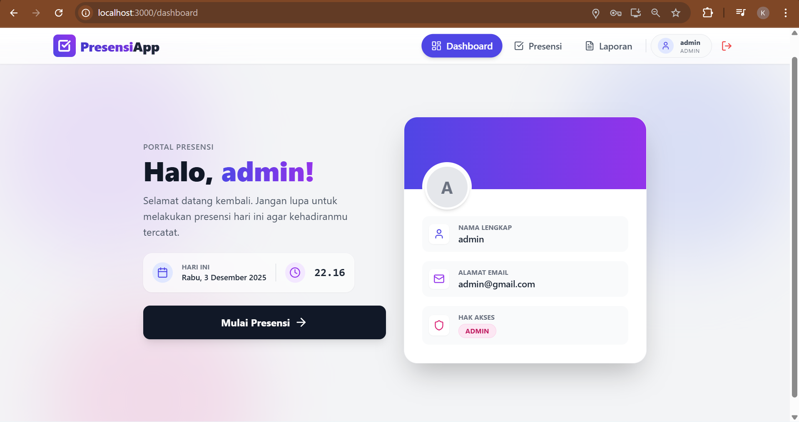
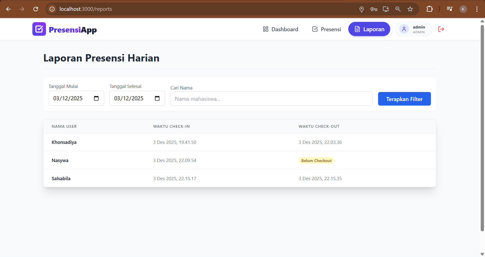

# Tugas 9 - Integrasi Final Full-Stack, Relasi Database, dan Geolocation

**Nama:** Khonsadiya Nasywa Salsabila
**NIM:** 20230140112 
**Kelas:** C 

---

## Screenshots Hasil Praktikum

### 1. Token ketika Login

### 2. Bearer Token saat Check-In

### 3. Latitude, Longitude ketika Check-In

### 4. Login Mahasiswa

### 5. Check-In dengan map OSM

### 6. Check-Out dengan map OSM

### 7. Login Admin

### 8. Report Berisi Data Presensi dari Semua User

### 9. Database Tabel Presensi
